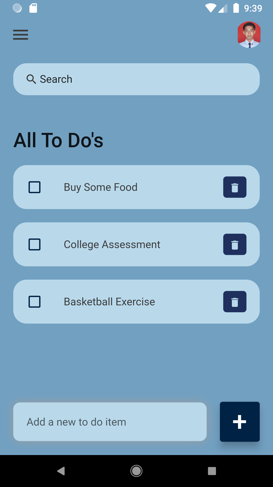
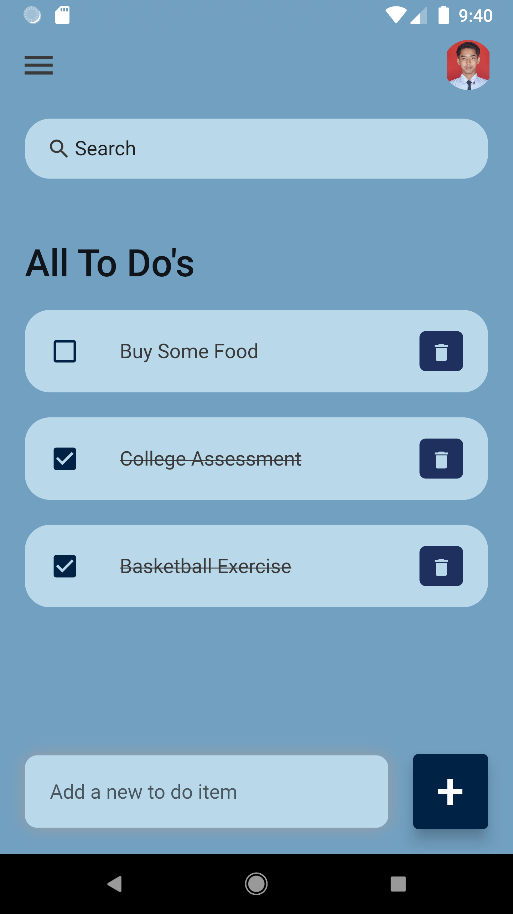
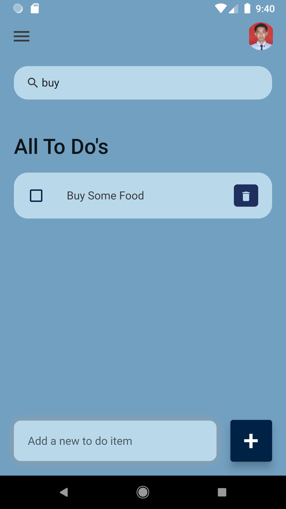

# To Do App

this my first flutter dummy project, a basic to do app built with flutter and dart language.
i learn this from [Pradip Debnath](https://www.youtube.com/watch?v=K4P5DZ9TRns&ab_channel=PradipDebnath).

## Screenshot
### Main

### Check Function

### Search Function

